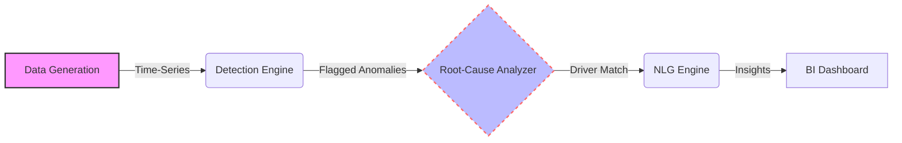
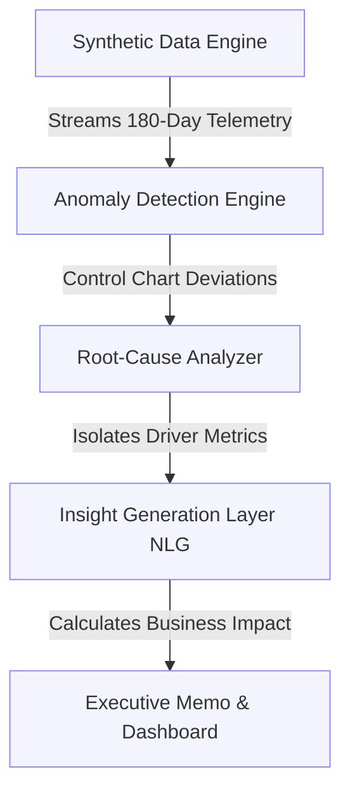

<h1 align="center">🛒 SwiftCart Intelligence</h1>
<h3 align="center">Diagnostic Business Analytics & Root-Cause Engine</h3>

<p align="center">


</p>

<p align="center">
  <strong>SwiftCart Intelligence</strong> is an automated diagnostic business analytics platform. By pairing <strong>rolling statistical control charts</strong> with an <strong>automated root-cause engine</strong>, SwiftCart transforms passive descriptive dashboards into active, self-diagnosing systems capable of continuous, real-time business anomaly detection and executive recommendation.
</p>

<hr>

### 📌 Project Overview
<hr>

Most analytics portfolios stop at descriptive analytics—showing *what* happened via revenue or operational dashboards. Traditional business intelligence relies on human analysts to manually hunt for the root causes of these deviations.

**SwiftCart Intelligence** solves this critical inefficiency by constructing an automated diagnostic pipeline:

- **Continuous Monitoring:** Ingests daily operational telemetry (orders, delivery times, rider counts, stockout rates) across 6 cities directly from the data warehouse.
- **Diagnostic Reasoning:** Statistically evaluates anomalous periods against baseline driver metrics to isolate exact root causes (e.g., distinguishing rider attrition from a competitor launch).
- **Forward Recommendation Generation:** Calculates estimated business impact and utilizes structured Natural Language Generation (NLG) to automatically generate and distribute executive action memos.

### 🔥 Key Features
<hr>

- **Automated Root-Cause Engine:** Continuous statistical comparison between anomalous events and candidate driver metrics.
- **Dynamic Control Charts:** Rolling 30-day baseline profiling (median ± 2.5σ) adapting dynamically to business growth and seasonality.
- **Template-Driven NLG:** Reproducible, auditable plain-English insight generation without relying on hallucination-prone LLMs.
- **Business Ground Truth Integration:** Synthetic data pre-embedded with 3 genuine business problems for the pipeline to detect.

**Step-by-Step Execution:**

1. **Telemetry Streaming:** The data generator creates daily metric logs (revenue, riders, stockouts) for 6 cities.
2. **Control Chart Evaluation:** The pipeline evaluates current daily metrics against a 30-day rolling baseline.
3. **Diagnostic Comparison:** Flags anomalies and performs percentage deviation checks on secondary drivers.
4. **Insight Translation:** Converts raw statistical deviations into actionable executive insights.
5. **Dashboard Visualization:** Renders interactive visualizations alongside the generated recommendation memo.

### 🛠️ System Architecture
<hr>

SwiftCart Intelligence operates a multi-layer analytical architecture connecting data ingestion, statistical anomaly detection, root-cause isolation, and dashboard presentation.



### 📁 Folder Structure
<hr>

Below is the production-ready directory structure designed for modular execution and interactive dashboarding.

```text
SwiftCart-Dashboard/
├── generate_data.py                    # Synthetic operational data generator
├── SwiftCart_Intelligence.ipynb        # Core pipeline: EDA, Detection, Root-Cause, NLG
├── dashboard_data.json                 # Extracted metrics for web visualization
├── executive_memo.md                   # Auto-generated executive recommendation memo
├── powerbi_tableau_build_guide.md      # BI tool integration documentation
├── swiftcart_daily_ops.csv             # Raw operational telemetry dataset
├── swiftcart_flagged_daily.csv         # Processed anomaly dataset
├── city_summary.csv                    # Aggregate city-level performance data
├── SwiftCart_Intelligence.html         # Notebook export (Analysis Report)
└── SwiftCart_Intelligence_Dashboard.html # Interactive web dashboard presentation
```

### 🔄 Product Workflow
<hr>



### 📊 Business Scenarios & Ground Truth
<hr>

The dataset deliberately embeds **three real business problems** so the pipeline has genuine root causes to identify:

| City | Business Problem | Root Cause |
| :--- | :--- | :--- |
| **Pune** | Delivery times spike for 3 weeks | Sudden rider attrition (~45% drop in active riders) |
| **Bhopal** | Revenue drops for 3 weeks | Recurring stockouts (~4.5x normal rate) |
| **Bangalore** | Customer churn climbs steadily | A competitor launches in the market |
